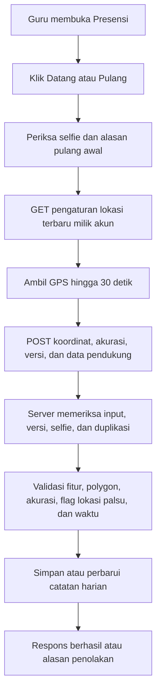

# Pemetaan fitur presensi SIDIKMA-24

Tanggal pemeriksaan: 16 September 2026. Sumber: kode workspace saat ini, migrasi, tampilan, panduan perbaikan sebelumnya, dan pengujian lokal. Workspace sudah memiliki banyak perubahan sebelum pemeriksaan; analisis ini mengikuti isi file yang ada, bukan hanya commit terakhir. Tidak ada perubahan logika aplikasi atau data produksi pada pekerjaan ini.

## 1. Komponen dan tanggung jawab

| Komponen | Tanggung jawab |
| --- | --- |
| `routes/web.php:82` | Endpoint di dalam middleware login; kelompok mobile role 2 dan admin presensi. |
| `app/Http/Controllers/AttendanceController.php:37` | Halaman guru, pengambilan pengaturan lokasi terbaru, penyimpanan datang/pulang, pengajuan izin. |
| `app/Services/AttendanceValidationService.php:13` | Pengaturan default, validasi lokasi/jam/fitur, perhitungan polygon, versi pengaturan. |
| `app/Models/Attendance.php` | Kolom harian datang/pulang dan pembacaan data format lama melalui accessor. |
| `public/js/attendance-location.js` | Mengambil sampel GPS dan menunggu lokasi yang memenuhi syarat. |
| `public/js/attendance-geofence.js` | Membandingkan titik dan polygon di browser. |
| `resources/views/backend/mobile_role2/presensi.blade.php` | Tombol, selfie, pemeriksaan GPS, alasan pulang awal, pengiriman, riwayat. |
| `app/Http/Controllers/AttendanceAdminController.php:111` | Dashboard, pengaturan, laporan, Excel, persetujuan izin, pembatasan sekolah. |
| `resources/views/backend/presensi/settings.blade.php` | Editor polygon Leaflet/OpenStreetMap dan pemeriksaan titik dari laporan. |
| `resources/views/backend/presensi/location.blade.php` | Koordinat, akurasi, tautan Maps dan Cek area dalam laporan. |
| `app/Console/Commands/DiagnoseAttendanceUser.php` | Diagnosis satu akun melalui CLI tanpa menulis data. |

## 2. Identitas sekolah dan hak akses

- `users.kelas_id` adalah identitas sekolah/madrasah yang digunakan presensi. Nama sekolah diambil dari `kelas.nama_kelas`.
- Role 2 melakukan presensi dan mengajukan izin. Controller menolak role lain dengan HTTP 403.
- Role 3 mengelola sekolah pada akunnya. Parameter sekolah dari browser tidak menggantikan sekolah akun role 3.
- Role 1 dapat memilih sekolah atau memantau seluruh sekolah. Halaman pengaturan memilih sekolah pertama berdasarkan nama jika tidak ada pilihan valid.
- Semua endpoint presensi memakai autentikasi web; POST mengikuti perlindungan CSRF pada kelompok web.
- Menu dashboard guru mengikuti pengaturan aktif. Navigasi bawah mobile selalu menampilkan Presensi; ini berbeda dari menu dashboard.

## 3. Pengaturan sekolah

`attendance_settings` memiliki satu baris unik per `kelas_id`. `settingForKelas()` menggunakan `firstOrCreate`, sehingga sebagian pembukaan halaman dapat membuat pengaturan jika belum tersedia. Endpoint GET lokasi menggunakan pembacaan biasa dan tidak membuat pengaturan.

Default dari service: datang/pulang/izin aktif, masuk 07:00, pulang 14:00, toleransi terlambat 10 menit, maksimum ketidakpastian GPS 100 meter, deteksi flag lokasi palsu aktif, selfie tidak wajib. Polygon belum tersedia secara default; sekolah tetap perlu mengaturnya.

Admin dapat mengatur polygon, jam, toleransi 0–240 menit, batas GPS 1–100 meter, serta sakelar fitur. Polygon minimal tiga koordinat valid dan harus membentuk bidang. Editor mendukung penambahan, penggeseran, penghapusan, undo, dan reset titik. Tombol Lokasi Saya hanya memeriksa/memusatkan lokasi; penyimpanan polygon dilakukan melalui Simpan Pengaturan.

Migrasi September mengganti nilai lama `max_gps_accuracy = 2` menjadi 100. Seleksinya berdasarkan angka, sehingga tidak membedakan default lama dan angka 2 yang sengaja dipilih admin. Penerapan migrasi di hosting belum diperiksa.

## 4. Alur dari HP sampai server



1. Halaman membaca pengaturan dan catatan hari ini. Riwayat menampilkan maksimal 10 baris, bukan seluruh percobaan.
2. Saat tombol ditekan, browser mencegah operasi GPS/presensi lain berjalan bersamaan pada halaman tersebut.
3. Sebelum mengambil GPS, browser memanggil `GET /mobile/role-2/presensi/lokasi` tanpa cache. Respons berisi identitas akun, nama sekolah, polygon, batas akurasi, dan hash versi.
4. Versi mengikat ID akun, sekolah, polygon normalisasi, dan batas GPS. Pergantian akun mengharuskan halaman dimuat ulang. Versi tidak mencakup jam, kewajiban selfie, atau sakelar fitur.
5. GPS memakai `watchPosition`, `enableHighAccuracy: true`, `maximumAge: 0`, timeout per permintaan 15 detik, dan batas keseluruhan 30 detik. Halaman harus memenuhi pemeriksaan secure context dan dukungan geolocation.
6. Sampel yang memenuhi batas akurasi dan berada di polygon segera digunakan. Sampel akurat di luar polygon ditahan sambil menunggu perbaikan; jika waktu habis, sampel luar dengan akurasi terbaik dikirim agar server memberi penolakan. Jika seluruh sampel kurang akurat, proses berhenti di browser.
7. Tombol Periksa GPS hanya menampilkan hasil, koordinat dan tautan Maps. Presensi selalu mengambil GPS baru, sehingga hasil kedua operasi bisa berbeda.
8. POST memvalidasi format koordinat, jenis presensi, akurasi, versi opsional, alasan pulang awal, dan file. Sekolah/polygon penerimaan tetap berasal dari server.
9. Jika versi yang dikirim sudah berubah, server mengembalikan 409 `location_settings_changed` tanpa menulis penolakan. Browser memuat pengaturan dan mengambil GPS baru, dengan satu percobaan ulang otomatis untuk konflik versi.
10. Selfie wajib yang tidak dikirim menghasilkan 422. Jenis presensi yang sudah diterima pada hari itu menghasilkan 409. Penolakan awal ini tidak masuk jalur penyimpanan presensi.
11. Setelah validasi layanan, controller menyimpan hasil dan membalas 200 jika diterima atau 422 jika ditolak.

## 5. Aturan penerimaan

Urutan dalam `validateAttendance()` adalah fitur aktif → polygon tersedia → akurasi valid → flag lokasi palsu → posisi di polygon → aturan waktu.

- Akurasi adalah maksimum ketidakpastian: batas 30 meter menerima nilai 5, 10, dan 30; nilai 31 ditolak. Nilai 0 juga diterima oleh validasi saat ini.
- Batas akurasi tidak memperluas area sekolah. Titik harus berada di polygon; tepi/sudut diterima dengan toleransi pembulatan 1 cm.
- Perhitungan browser dan PHP memakai algoritme setara, termasuk polygon cekung dan jarak ke sisi terdekat.
- Lokasi palsu ditolak bila deteksi aktif dan salah satu flag `is_mock_location`, `mock_location_detected`, `mocked`, atau `isFromMockProvider` bernilai benar. Kode tidak melakukan verifikasi integritas perangkat di server; flag berasal dari klien. UI membaca properti koordinat atau jembatan `AndroidLocation` jika tersedia.
- Waktu penerimaan menggunakan `now()` server. Konfigurasi aplikasi adalah `Asia/Jakarta`.
- Datang setelah jam masuk ditambah toleransi berstatus `terlambat`; tepat pada batas masih `hadir`.
- Pulang sebelum jam pulang diterima jika alasan tidak kosong. Alasan disimpan sebagai catatan `Pulang awal: ...`; tidak melalui persetujuan izin.
- Belum ada syarat harus datang sebelum pulang, kalender hari kerja/libur, jadwal per hari, shift lintas tengah malam, atau batas akhir datang dalam alur yang diperiksa.

## 6. Penyimpanan dan kompatibilitas data

Tiga tabel utama: `attendance_settings`, `attendances`, dan `attendance_permissions`. Migrasi kedua menambah kolom `check_in_*`/`check_out_*` pada presensi; tidak memindahkan atau menggabungkan data lama.

Controller berusaha memakai satu baris per pengguna per tanggal. Ia mengambil baris bukan ditolak terlebih dahulu, atau baris pertama bila semua ditolak. Waktu, lokasi, akurasi, selfie, flag, alasan, dan perangkat untuk setiap jenis disimpan terpisah.

| Kejadian | Perubahan utama |
| --- | --- |
| Percobaan pertama | Membuat baris berisi kolom umum dan kolom jenis percobaan. |
| Datang berikutnya yang belum pernah diterima | Memperbarui kolom umum, status baris, dan kolom datang. |
| Pulang setelah datang diterima | Memperbarui kolom pulang; status hadir/terlambat saat datang dipertahankan. |
| Pulang tanpa datang diterima | Memperbarui kolom pulang dan status/alasan umum. |
| Percobaan ditolak | Menyimpan koordinat/alasan pada kolom jenis; tidak mengisi timestamp penerimaan jenis itu. |

Accessor `check_in_time` dan `check_out_time` mengutamakan timestamp harian. Jika kolom harian tidak tersedia pada record, accessor dapat memakai format lama `check_type`/`checked_at`, dengan syarat record tidak menunjukkan penolakan. Catatan terlambat/pulang awal juga memakai kolom bernama `rejection_reason`, meskipun presensinya diterima.

Penyimpanan ini bukan log setiap percobaan: percobaan ulang dapat menimpa alasan/koordinat sebelumnya. Tidak ada snapshot polygon atau versi pengaturan per percobaan. Penolakan sebelum POST atau sebelum jalur simpan tidak menghasilkan record.

Selfie disimpan pada disk `public` di `attendance/selfies`; lampiran izin di `attendance/permissions`. Tidak ditemukan pembersihan file lama ketika path diganti. Batas upload controller saat ini `1048576` KB per file; middleware upload dan konfigurasi PHP/server juga dapat membatasi permintaan.

## 7. Izin, dashboard dan laporan

Izin menerima kategori `terlambat`, `sakit`, `tidak_masuk`, `tugas_dinas`, dan `cuti`. Tanggal selesai harus sama atau setelah tanggal mulai; alasan wajib, lampiran JPG/JPEG/PNG/PDF opsional. Pengajuan masuk sebagai `pending`, lalu admin memberi `approved`/`rejected`, catatan, ID reviewer, dan waktu review. Persetujuan tidak mengubah baris presensi atau menghapus status terlambat.

Dashboard menghitung pengguna unik dengan presensi bukan ditolak hari ini. Kehadiran mencakup hadir dan terlambat, bahkan jika hanya pulang yang berhasil. Izin yang diperhitungkan harus approved dan mencakup tanggal tersebut. Tidak hadir dihitung dari total akun role 2 dikurangi jumlah hadir dan jumlah pengguna berizin. Grafik mencakup tujuh hari kalender, beserta delapan aktivitas terbaru dan peta titik hari ini.

Laporan menyediakan harian, mingguan Senin–Minggu, bulanan, atau rentang bebas; filter sekolah untuk role 1, pengguna, dan status. Kehadiran dan izin ditampilkan terpisah. Filter izin/cuti pada laporan memilih kategori dan tetap dapat menampilkan pending/rejected beserta statusnya. Export Excel memakai data filter yang sama pada dua sheet, Presensi dan Izin. Tidak ada pembentukan baris alpa untuk tiap pengguna/tanggal tanpa record.

## 8. Temuan yang perlu diperhatikan saat memperbaiki

Temuan berikut berasal dari penelusuran kode. Skenario risiko yang belum direproduksi ditandai; semuanya belum membuktikan kejadian di hosting.

| Prioritas | Temuan dan dampak | Dasar |
| --- | --- | --- |
| Tinggi | Role 3 dengan `kelas_id` kosong/0 tidak mendapat filter sekolah karena filter hanya diterapkan jika ID truthy. Berpotensi membaca lintas sekolah dan mereview izin lintas sekolah. Perlu validasi sekolah yang menolak akses jika sekolah akun tidak tersedia. | `AttendanceAdminController.php:33`, `:63`, `:408`; penelusuran kode, belum tes HTTP skenario ini. |
| Tinggi | Rumus tidak hadir mengurangi hadir dan izin secara terpisah. Contoh 10 guru, 5 hadir, dan 1 dari 5 guru itu juga berizin terlambat menghasilkan 4 tidak hadir, padahal 5 guru belum tercakup. Hitungan kategori/grafik izin juga menghitung baris, sehingga pengajuan tumpang tindih bisa terhitung ganda. | `AttendanceAdminController.php:128`, `:217`, `:219`. |
| Tinggi | Pencegahan duplikasi memakai baca lalu tulis tanpa transaksi/lock; indeks pengguna+tanggal bukan unique. Permintaan bersamaan dari dua tab/perangkat berpotensi membuat dua baris atau menimpa event. | `AttendanceController.php:130–212`; migrasi awal; risiko concurrency belum direproduksi. |
| Sedang | Pulang ditolak setelah datang diterima tetap berstatus baris hadir/terlambat. Filter laporan `ditolak` hanya melihat status baris, sehingga penolakan pulang tersebut tidak muncul dalam filter itu. | `AttendanceController.php:203`; `AttendanceAdminController.php:440`. |
| Sedang | Peta mengutamakan koordinat pulang meskipun pulang ditolak, tetapi waktu/label dapat tetap berasal dari datang yang berhasil. Marker dapat memasangkan lokasi percobaan gagal dengan jam kedatangan. | `AttendanceAdminController.php:182–207`. |
| Sedang | Setelah pulang berhasil tanpa datang, percobaan datang yang ditolak menimpa status baris menjadi ditolak sambil menyisakan `check_out_at`. Pembacaan hari ini dan pengecekan duplikasi mengabaikan seluruh baris ditolak. Akibat yang mungkin: pulang berhasil tersembunyi pada ringkasan dan bisa dicatat ulang. | `AttendanceController.php:50`, `:135`, `:200`; rangkaian spesifik ini belum ada dalam tes. |
| Sedang | Catatan percobaan tertimpa, timestamp khusus percobaan gagal tidak tersedia, dan polygon historis tidak disimpan. Diagnosis hanya dapat membandingkan lokasi lama dengan pengaturan sekarang. | Jalur simpan controller dan `DiagnoseAttendanceUser.php`. |
| Sedang | Jam berjalan dan pemicu dialog pulang awal mengikuti jam/zona waktu HP, sedangkan server memakai waktu aplikasi. Jam pulang yang tertanam di halaman juga tidak ikut refresh konteks lokasi. Dapat memicu permintaan alasan yang tidak sesuai atau penolakan server tanpa dialog alasan terlebih dahulu. | `presensi.blade.php:160–205`; `AttendanceValidationService.php:102`. |
| Rendah | Jenis presensi yang dinonaktifkan menampilkan badge Tercatat melalui cabang else walaupun belum ada event. Menu bawah tetap muncul ketika fitur seluruhnya dimatikan dan halaman akan 403. | `presensi.blade.php:77–99`; `mobile_role2/layout.blade.php:392`. |
| Sedang | `rejected()` mengisi `is_inside_geofence=true` untuk banyak penolakan yang terjadi sebelum pemeriksaan polygon, misalnya akurasi buruk. Flag tersebut tidak selalu berarti titik benar-benar telah diperiksa di dalam area. | `AttendanceValidationService.php:266`. |

Hal lain untuk perencanaan: laporan memakai `get()` tanpa pagination; parsing tanggal laporan belum memakai validasi request; data legacy bisa tetap memiliki dua baris per hari; perpindahan sekolah akun perlu aturan historis karena pencarian catatan harian hanya berdasarkan pengguna dan tanggal. Deteksi flag lokasi palsu dan unggahan selfie saat ini tidak menyediakan pembuktian lokasi/perangkat atau pemeriksaan wajah/liveness.

## 9. Hasil verifikasi dan batas kesimpulan

Perintah yang dijalankan pada pemeriksaan ini:

```text
php vendor/phpunit/phpunit/phpunit --filter 'AttendanceValidationTest|AttendanceAccuracyTest|AttendanceGeofenceTest|AttendanceDiagnosisTest' --do-not-cache-result
node --test tests/attendance-location.test.cjs tests/attendance-geofence.test.cjs tests/attendance-mobile.test.cjs tests/attendance-settings.test.cjs
```

Hasil: **28 tes PHP lulus, 306 assertions; 28 tes JavaScript lulus**. Tes feature presensi memakai SQLite di memori dan data sintetis. Tes JavaScript memakai simulasi browser/DOM/GPS; bukan pembacaan GPS HP sungguhan.

Cakupan yang sudah diuji meliputi pembanding akurasi, polygon sisi/sudut/cekung, percobaan ulang, koordinat datang/pulang terpisah, sinkronisasi pengaturan, pergantian akun, kegagalan GPS, editor area, dan diagnosis tanpa menulis data. Cakupan ini belum membuktikan hitungan dashboard, seluruh akses admin, request bersamaan, kalender kerja, maupun kondisi perangkat/hosting.

Kode pada hosting aktif, status migrasi produksi, konfigurasi PHP web/OPcache, polygon nyata, dan keberhasilan presensi akun nyata belum diverifikasi. Panduan September sebelumnya juga membedakan kode workspace dan pemasangan hosting; hasil lokal tidak otomatis berarti server sudah memakai versi yang sama.

## 10. Acuan pekerjaan berikutnya

Perbaikan dapat diarahkan sesuai keluhan: untuk penolakan GPS, telusuri pesan terbaru → sekolah akun → konteks pengaturan → sampel koordinat/akurasi → validator aktif; untuk rekap, telusuri status per event → penggabungan hadir/izin → kebijakan hari kerja; untuk riwayat, tentukan apakah setiap percobaan harus disimpan terpisah.

Jika keluhan spesifik belum ditentukan, dasar teknis yang layak diprioritaskan adalah pembatasan sekolah admin, konsistensi status datang/pulang, dan perhitungan pengguna hadir/berizin tanpa hitung ganda. Perubahan aturan seperti wajib datang sebelum pulang atau kalender kerja memerlukan penetapan perilaku yang diinginkan pengguna.
